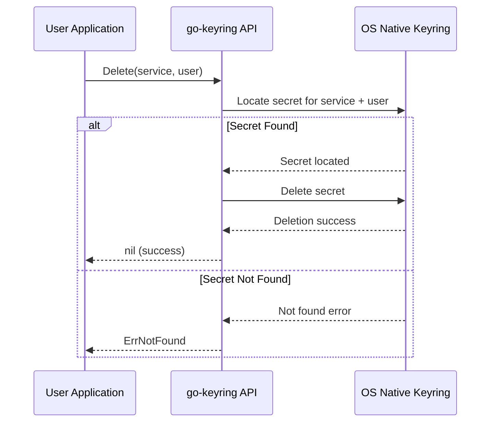

# Delete Secret API Reference

The `Delete` API enables you to remove an existing secret from the system keyring securely and consistently across platforms. This documentation covers how to invoke the delete operation, handle errors (including attempts to delete non-existent secrets), and provides practical examples targeting major supported operating systems—macOS, Linux/BSD, and Windows.

Deleting secrets is an essential part of secret lifecycle management when credentials are no longer needed or must be revoked promptly to maintain security. This page guides you through the API usage, input validation, real-world usage scenarios, and troubleshooting tips.

---

## Overview

- **Purpose**: Remove a stored secret identified by a service and user combination from the OS-native keyring.
- **Supported Platforms**: macOS, Linux/BSD (using Secret Service API and GNOME Keyring), and Windows (Credential Manager).
- **Interface**: Single function call `Delete(service, user string) error` exposed by the `go-keyring` library.


## API Usage

### Function Signature
```go
func Delete(service, user string) error
```

- **service**: The name of your application or service under which the secret was stored.
- **user**: Identifier for the user or account associated with the secret.

### Behavior
- Removes the secret associated with the provided `service` and `user`.
- Returns an error if the secret does not exist.
- Ensures native platform keyring consistency.

### Error Handling
- Returns `ErrNotFound` if the key combination is not found.
- Returns platform-specific errors for operational failures.

### Example Usage

```go
package main

import (
    "log"

    "github.com/zalando/go-keyring"
)

func main() {
    service := "my-app"
    user := "anon"

    // Delete the secret
    err := keyring.Delete(service, user)
    if err != nil {
        if err == keyring.ErrNotFound {
            log.Printf("Secret for user '%s' in service '%s' not found. Nothing to delete.", user, service)
        } else {
            log.Fatalf("Failed to delete secret: %v", err)
        }
    } else {
        log.Printf("Secret successfully deleted.")
    }
}
```


## Platform-Specific Notes

### macOS
- Utilizes the `/usr/bin/security` binary with the `delete-generic-password` command.
- Returns `ErrNotFound` if the secret does not exist.
- Deletes secrets by matching service and account (user).

### Linux/BSD
- Interfaces with the Secret Service DBus API provided by GNOME Keyring.
- Unlocks necessary collections before deleting.
- Returns `ErrNotFound` if matching secret cannot be found.

### Windows
- Uses Windows Credential Manager via the `wincred` package.
- Deletes credentials matching service and user keys.
- Returns `ErrNotFound` if the credential is not present.


## Input Validation and Best Practices

- Ensure `service` and `user` parameters exactly match the identifiers used when the secret was stored.
- Avoid empty strings for service and user, as these may lead to unintended behavior.
- Always handle and check the returned error; treat `ErrNotFound` as an expected condition.
- Do not rely on absence of errors alone to confirm deletion—consider using `Get` after deletion to verify when appropriate.

## Common Pitfalls

- Attempting to delete a secret that does not exist results in `ErrNotFound`. This is not a failure but an important signal.
- Typos in `service` or `user` names lead to failed deletions.
- Platform-specific restrictions or permission issues might block deletion.


## Troubleshooting

<Tip>
If you encounter errors deleting secrets:

- Verify that the `service` and `user` combination exist by attempting a `Get` call first.
- On Linux/BSD, ensure the keyring daemon (like GNOME Keyring) is running and unlocked.
- On macOS, confirm the `/usr/bin/security` tool is accessible and that you have necessary permissions.
- On Windows, check Windows Credential Manager status and user permissions.
- Consult the [Troubleshooting & Common Setup Issues](/getting-started/usage-validation/troubleshooting) guide for platform-specific tips.
</Tip>


## Related API Functions

- **Set**: Store or update a secret.
- **Get**: Retrieve a stored secret.
- **DeleteAll**: Remove all secrets matching a given service.


## Deleting All Secrets for a Service

Sometimes you may want to remove all secrets related to a particular service regardless of user. Use:

```go
func DeleteAll(service string) error
```

- Deletes all secrets under the specified service.
- Returns `ErrNotFound` if the service has no associated secrets.
- Does not delete secrets if the service parameter is empty (to avoid accidental mass deletion).

Example:

```go
err := keyring.DeleteAll("my-app")
if err != nil {
    if err == keyring.ErrNotFound {
        fmt.Println("No secrets found for service 'my-app'.")
    } else {
        log.Fatalf("Error deleting all secrets: %v", err)
    }
} else {
    fmt.Println("All secrets for 'my-app' deleted.")
}
```


## Summary
Deleting secrets is a straightforward yet critical operation to maintain security hygiene within applications using go-keyring. The `Delete` method leverages the native OS keyring capabilities to remove user-specific credentials safely. Handling the `ErrNotFound` error gracefully is essential to building resilient secret management logic.

---

## Additional Example Scenarios

### Attempting to Delete a Non-Existent Secret

```go
err := keyring.Delete("my-app", "nonexistent-user")
if err == keyring.ErrNotFound {
    fmt.Println("No secret found; nothing deleted.")
} else if err != nil {
    fmt.Printf("Unexpected error: %v", err)
} else {
    fmt.Println("Secret deleted successfully.")
}
```


### Deleting Secrets During User Logout

When implementing user logout, ensure secrets associated with the session user are removed:

```go
func LogoutUser(service, user string) error {
    err := keyring.Delete(service, user)
    if err != nil {
        if err == keyring.ErrNotFound {
            // Secret already deleted or never existed
            return nil
        }
        return err
    }
    return nil
}
```


## See Also

- [Set Secret API Reference](/api-reference/core-keyring-apis/set-secret)
- [Get Secret API Reference](/api-reference/core-keyring-apis/get-secret)
- [Delete All Secrets API Reference](/api-reference/core-keyring-apis/delete-secret#deleteall)
- [Platform Integration & Dependencies](/overview/architecture-usecases-integration/platform-integration)
- [Troubleshooting & Common Setup Issues](/getting-started/usage-validation/troubleshooting)


---

## Diagram: Secret Deletion Flow



This flowchart shows the typical interaction for deleting a secret, clearly distinguishing the success and not-found paths.

---

## Summary Table: Delete API and Related Functions

| Function      | Description                              | Returns                    | Key Error          |
|---------------|------------------------------------------|----------------------------|--------------------|
| `Delete`      | Delete a specific secret by service/user | `nil` on success, error else | `ErrNotFound` if not found |
| `DeleteAll`   | Delete all secrets by service             | `nil` on success, error else | `ErrNotFound` if none found |


---

## Practical Tips

- Always check for `ErrNotFound` and handle it gracefully; do not treat it as a fatal error.
- Prefer using `DeleteAll` when you want to clean up all user secrets under a specific service.
- Incorporate error checks in logout or credential revocation flows to ensure secrets are properly cleared.
- Use the mock provider during tests to simulate deletion behavior without platform dependencies.

<Check>
Before attempting to delete secrets in production code:
- Verify your identifiers for `service` and `user`.
- Test delete operations with the mock provider to reduce platform-specific surprises.
- Consult platform integration notes to confirm any permissions or environment setup.
</Check>

---