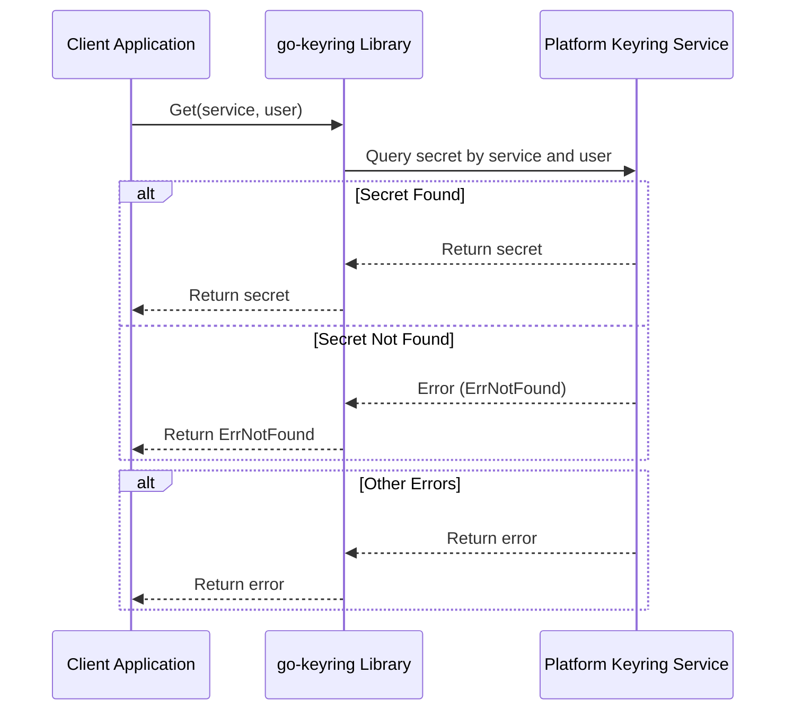

# Get Secret API Reference

Retrieving a stored secret from the system keyring is a core operation in the `go-keyring` library. This page explains how to fetch a secret tied to a given service and user from the keyring securely and reliably. It covers the method signature, parameters, return structure, platform-specific considerations, error handling, and practical examples to help you integrate and test the retrieval functionality.

---

## Overview

The `Get` function retrieves a secret previously stored in the system keyring by referencing the service name and user name. It abstracts the underlying operating system's native keychain or secret service, providing a consistent API for Windows, macOS, Linux, and BSD platforms.

Goals when using this API:

- Access your stored secret (e.g., passwords, tokens) seamlessly.
- Handle missing secrets gracefully.
- Leverage native security features without managing platform-specific details.


## Method Signature

```go
func Get(service, user string) (string, error)
```

- **service**: The identifier of your application or system resource that the secret is associated with.
- **user**: The user name or account name associated with the secret.

Returns the secret as a string, or an error if retrieval fails.


## Parameter Details

| Parameter | Type   | Description                                      |
|-----------|--------|--------------------------------------------------|
| `service` | string | Unique name for your app or service.              |
| `user`    | string | Username or account linked to the stored secret. |

> Both parameters uniquely identify the secret in the keyring.


## Return Value

- On success: Returns the secret value as a UTF-8 string.
- On failure: Returns an error describing the failure reason.


## Common Errors

| Error          | Cause                                           | Recommended Action                              |
|----------------|-------------------------------------------------|------------------------------------------------|
| `ErrNotFound`  | No secret exists for the given service & user. | Verify identifiers; create the secret if needed. |
| Other errors   | Underlying system or permission issues.         | Check system keyring availability and permissions; see troubleshooting tips below. |


## Platform-Specific Behavior

- **Windows**: Uses Windows Credential Manager via `wincred` package. Secrets stored with service and username combined as `service:username`. Password size limited to 2560 bytes. Service name length constraints exist.

- **macOS**: Uses the `security` CLI utility to fetch secrets from the macOS keychain. Passwords are base64 or hex decoded if previously encoded.

- **Linux/BSD**: Utilizes the DBus Secret Service API (e.g., GNOME Keyring). Unlocks keyring collections and retrieves secrets securely.


## Usage Example

This example demonstrates retrieving a secret from the keyring using the `Get` function.

```go
package main

import (
    "fmt"
    "log"

    "github.com/zalando/go-keyring"
)

func main() {
    service := "my-app"
    user := "alice"

    secret, err := keyring.Get(service, user)
    if err != nil {
        if err == keyring.ErrNotFound {
            fmt.Printf("No secret found for user '%s' in service '%s'.\n", user, service)
            // Optionally prompt user to store one
        } else {
            log.Fatalf("Failed to get secret: %v", err)
        }
        return
    }

    fmt.Printf("Retrieved secret for %s: %s\n", user, secret)
}
```


## Internal Workflow

When you invoke `Get(service, user)`, the library:  
1. Determines the running platform (Windows, macOS, Linux/BSD).  
2. Calls the respective platform provider (`windowsKeychain`, `macOSXKeychain`, or `secretServiceProvider`).  
3. Uses OS-native APIs or commands to fetch the secret securely.  
4. Handles errors including missing secrets or permissions.  
5. Returns the decoded secret string or an error.


## Best Practices

- Ensure correct and consistent `service` and `user` strings across your app; mismatches cause secrets to be not found.
- Check and handle `ErrNotFound` to guide users to set a secret before retrieval.
- Avoid storing very large secrets, especially on Windows and macOS, which have documented size limits.
- Use the `Set` function first to store secrets securely before attempting to `Get` them.
- Bear in mind multi-line or special character secrets are properly encoded/decoded on macOS.


## Troubleshooting Common Issues

<AccordionGroup title="Common Issues When Retrieving a Secret">
<Accordion title="Secret Not Found (ErrNotFound)">
If you get `ErrNotFound`, verify that:
- The secret was stored previously with matching `service` and `user`.
- You are querying the correct keyring collection or service identifier.

Try storing the secret again using `Set` and then retrieve.
</Accordion>

<Accordion title="Permission Denied or Access Errors">
Some platforms may restrict access to keyrings when running under limited permissions.

- On Linux/BSD, ensure the Secret Service daemon (e.g., GNOME Keyring) is running and unlocked.
- On macOS, confirm your app or CLI has access to the keychain.
- On Windows, verify your user profile and credential manager accessibility.

</Accordion>

<Accordion title="Unexpected Errors or Timeouts">
Ensure the system keyring service or daemon is operational and your environment supports required dependencies:
- macOS requires `/usr/bin/security` binary (default on system).
- Linux requires active DBus session with Secret Service interface.
- Windows requires Credential Manager support.

Rebooting or restarting keyring services can resolve transient issues.
</Accordion>

</AccordionGroup>


## Advanced Considerations

- When running in automated or CI environments, ensure keyring services are available, or use the mock provider for testing (see related documentation).
- Multi-threaded or concurrent access is supported as underlying OS handles synchronization.
- For large secrets on non-Windows platforms, while no explicit limit exists, extremely large values could impact performance.


## Related APIs

- [Set Secret](./set-secret) — Store a secret for a user and service.
- [Delete Secret](./delete-secret) — Remove a stored secret.
- [Mock Provider for Testing](../platform-and-testing-apis/mock-provider) — Use an in-memory keyring for tests.
- [Error Handling and Status Codes](../platform-and-testing-apis/error-handling) — Understand failure scenarios.


---

## Summary Diagram of Secret Retrieval Flow




## Further Reading & Resources

1. [Platform Integration & Dependencies](../../overview/architecture-usecases-integration/platform-integration) — Understand each OS's backend requirements.
2. [Prerequisites & Supported Platforms](../../getting-started/setup-basics/prerequisites) — Details on supported OS environments.
3. [Quickstart: Set and Get Your First Secret](../../getting-started/usage-validation/quickstart-example) — Hands-on example.
4. [Troubleshooting & Common Setup Issues](../../getting-started/usage-validation/troubleshooting) — Resolve environment-specific errors.


<Check>
Remember to handle errors explicitly when calling `Get` for a smooth user experience. Missing secrets should be expected and managed gracefully.
</Check>