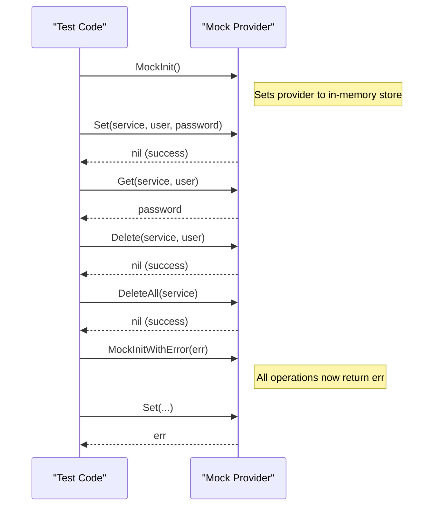

# Mock Provider for Testing

The mock provider in go-keyring offers an in-memory keyring implementation designed specifically for unit tests, continuous integration environments, and local validation scenarios where access to a real system keyring is unavailable or undesirable. It replicates the core keyring operations (`Set`, `Get`, `Delete`, and `DeleteAll`) with a simple map-based storage, ensuring your tests remain deterministic, isolated, and side-effect free.

---

## Why Use the Mock Provider?

When developing or testing applications that depend on secret management, relying on platform keyrings can cause complexity, unpredictability, or require elevated permissions. The mock provider eliminates external dependencies and OS variability by providing:

- Fast, in-memory secret storage that resets with each test run.
- Full API compatibility with the main keyring interface.
- Configurable error simulation for robust error handling tests.

This allows you to test secrets-related logic thoroughly without touching the real keyring or user credentials.

---

## Enabling the Mock Provider

Activate the mock provider simply by calling:

```go
keyring.MockInit()
```

Once initialized, all keyring operations (`Set`, `Get`, `Delete`, `DeleteAll`) route to the in-memory mock storage.

### Example

```go
package yourpackage

import (
    "testing"

    "github.com/zalando/go-keyring"
)

func TestMockedSetGet(t *testing.T) {
    keyring.MockInit() // Activate the mock provider

    service := "test-service"
    user := "test-user"
    password := "top-secret"

    if err := keyring.Set(service, user, password); err != nil {
        t.Fatalf("Set failed: %v", err)
    }

    got, err := keyring.Get(service, user)
    if err != nil {
        t.Fatalf("Get failed: %v", err)
    }

    if got != password {
        t.Errorf("Got %q, want %q", got, password)
    }
}
```

---

## Supported Operations

The mock provider supports the following keyring methods with the exact behavior and signatures as the real provider:

- `Set(service, user, password string) error` — Store a secret.
- `Get(service, user string) (string, error)` — Retrieve a secret.
- `Delete(service, user string) error` — Remove a secret.
- `DeleteAll(service string) error` — Remove all secrets for a service.

It correctly returns standard errors like `ErrNotFound` when a secret or service does not exist.

---

## Simulating Errors

For more advanced testing, you can inject a persistent error that the mock provider returns on all operations.

Use:

```go
keyring.MockInitWithError(errors.New("mock induced error"))
```

This simulates error conditions such as backend failures, enabling you to verify your application's resilience.

---

## Typical Usage Workflows

### 1. Basic Secret Store and Retrieve

1. Initialize mock with `MockInit()`.
2. Use `Set` to save secrets.
3. Use `Get` to read secrets.
4. Use `Delete` or `DeleteAll` to clean up.

### 2. Testing Error Scenarios

1. Initialize mock with `MockInitWithError(yourError)`.
2. Perform any keyring operation to receive the predefined error.
3. Validate your application's error handling logic.

---

## Best Practices

- **Use Isolation:** Call `MockInit()` at the start of each test to ensure a clean slate.
- **Avoid Sharing State:** Do not share the mock provider state between tests to prevent leakage.
- **Error Simulation:** Use `MockInitWithError` selectively to isolate error paths.
- **Reset for CI:** Ensure tests using the mock run in CI environments for reliable non-interactive testing.

---

## Common Pitfalls and Troubleshooting

- Forgetting to call `MockInit()` will cause tests to interact with the real keyring, potentially leading to flaky tests or permission errors.

- The mock provider stores data only in memory and will lose all secrets after the program exits or the test completes.

- Simulating large secrets or boundary cases still requires understanding platform constraints, as mock provider does not enforce size limits.

- Verify that errors returned by the mock provider match your expectations; use the helper function `assertError` in tests for clarity.

---

## Related Documentation

- [Set Secret API](/api-reference/core-keyring-apis/set-secret): Use secrets storage methods with real platform providers.
- [Get Secret API](/api-reference/core-keyring-apis/get-secret): Retrieve secrets from the system keyring.
- [Delete Secret API](/api-reference/core-keyring-apis/delete-secret): Securely delete secrets.
- [Platform Integration & Dependencies](/overview/architecture-usecases-integration/platform-integration): Understanding real keyring backends.
- [Testing and Mock Validation Guide](/getting-started/usage-validation/mock-validation): Practical guidance on test setup with mocks.

---

## Summary Diagram of Mock Workflow



---

This mock provider is central to achieving reliable and secure testing for projects employing go-keyring, promoting test isolation while preserving fidelity to the real interface.
