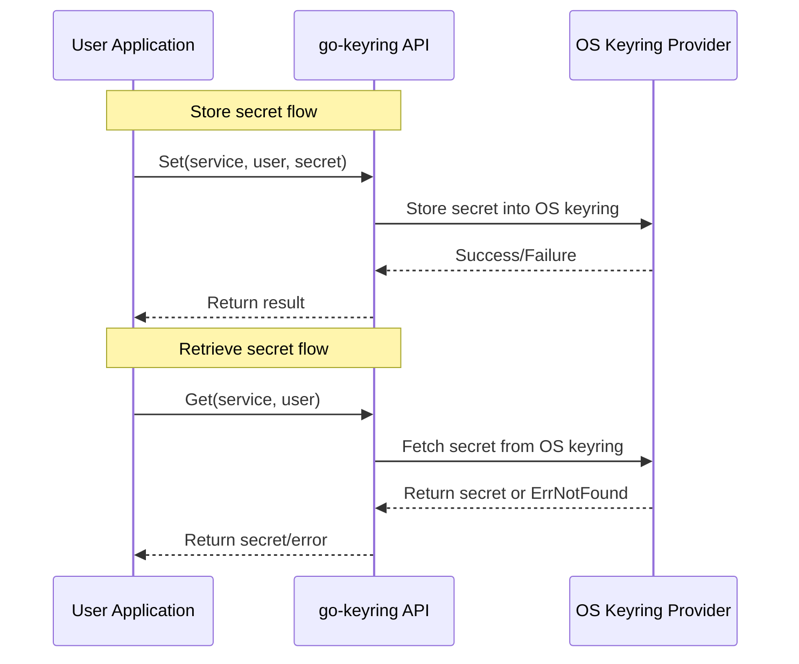

# How to Store and Retrieve Secrets with go-keyring

Manage your application secrets securely and efficiently using the `go-keyring` library. This guide walks you through the entire workflow to **store** and **retrieve** secrets (like API keys, passwords, tokens) on native OS keyrings, covering practical usage, best practices, error handling, and cross-platform considerations.

---

## 1. Workflow Overview

### Purpose
Enable your application to securely **store** and **retrieve** user credentials or other sensitive data from the OS-native keyring using a simple, unified Go API.

### Prerequisites
- Go development environment set up
- Supported OS platforms: **macOS**, **Linux/BSD**, **Windows**
- For Linux/BSD: Ensure [GNOME Keyring](https://wiki.gnome.org/Projects/GnomeKeyring) is installed and running (with a login keyring collection)
- For macOS: ensure the `/usr/bin/security` binary is available (default setup)
- For Windows: Windows Credential Manager accessible

### Expected Outcome
By following this guide, you will:
- Understand how to define service and user identifiers
- Store secrets safely under these identifiers
- Retrieve stored secrets reliably
- Handle common errors gracefully

### Time Estimate
Approximately 10-15 minutes for initial setup and testing

### Difficulty Level
Beginner to Intermediate

---

## 2. Storing Secrets

Use `keyring.Set` to save a secret tied to a specific service and user. The service and user strings uniquely identify each secret.

<Steps>
<Step title="Step 1: Define the service and user keys">
Choose clear, stable identifiers. For example:

```go
service := "my-cli-tool"
user := "alice@example.com"
```

These strings organize and isolate secrets within the OS keyring.
</Step>

<Step title="Step 2: Store the secret">
Call `keyring.Set(service, user, secret)` to store the secret data.

```go
password := "s3cr3tP@ssw0rd"
err := keyring.Set(service, user, password)
if err != nil {
    log.Fatalf("Failed to save secret: %v", err)
}
```

- The secret can be any string data, including multi-line or Unicode content.
- Platform implementations handle necessary encoding transparently.
</Step>
</Steps>

### What happens behind the scenes
- On **macOS**, `go-keyring` encodes secrets in base64 to avoid data corruption and calls the native `security` command-line tool.
- On **Linux/BSD**, it interfaces with the Secret Service DBus API (typically GNOME Keyring)
- On **Windows**, it stores secrets using the Windows Credential Manager APIs

### Best Practices
- Keep service and user names consistent across your app lifecycle.
- Avoid excessively large secrets (follow platform size constraints; typical limits are ~3KB on macOS, 2560 bytes for Windows passwords).

### Common Pitfalls
- Omitting service or user causes failures.
- Storing very large secrets can cause `ErrSetDataTooBig` errors.

---

## 3. Retrieving Secrets

Retrieve stored secrets by calling `keyring.Get` with the matching service and user keys.

<Steps>
<Step title="Step 1: Use matching identifiers">
The `service` and `user` keys must exactly match those used when setting the secret.

```go
service := "my-cli-tool"
user := "alice@example.com"
```
</Step>

<Step title="Step 2: Retrieve the secret">
Use `keyring.Get`:

```go
secret, err := keyring.Get(service, user)
if err != nil {
    if err == keyring.ErrNotFound {
        log.Println("Secret not found in keyring")
    } else {
        log.Fatalf("Failed to retrieve secret: %v", err)
    }
}
log.Printf("Retrieved secret: %s", secret)
```

- Returns the original secret string you stored.
</Step>
</Steps>

### Handling errors
- `ErrNotFound` indicates no secret found for given keys.
- Other errors indicate platform-specific or environment issues.

---

## 4. Complete Example

Here is a minimal, runnable example demonstrating storing and then retrieving a secret:

```go
package main

import (
    "log"
    "github.com/zalando/go-keyring"
)

func main() {
    service := "example-service"
    user := "user@example.com"
    password := "my$ecret123"

    // Store the secret
    if err := keyring.Set(service, user, password); err != nil {
        log.Fatalf("Error storing secret: %v", err)
    }

    // Retrieve the secret
    secret, err := keyring.Get(service, user)
    if err != nil {
        log.Fatalf("Error retrieving secret: %v", err)
    }

    log.Printf("Retrieved secret: %s", secret)
}
```

Run this program on your target OS to verify that secrets are correctly stored and retrieved.

---

## 5. Handling Multi-line and Unicode Secrets

The library transparently encodes secrets to accommodate non-ASCII and multi-line strings:

- Multi-line values including newline characters are supported without extra effort.
- Unicode characters (e.g., umlauts, emojis) are safely stored and retrieved.

You can test this by storing such values and verifying they match on retrieval.

---

## 6. Error Handling and Common Issues

| Issue                      | Cause                                        | Resolution / Tip                                         |
|----------------------------|----------------------------------------------|----------------------------------------------------------|
| `ErrNotFound`              | Secret missing or keys incorrect             | Confirm service & user strings match                    |
| `ErrSetDataTooBig`         | Secret or service string exceeds platform limits | Use shorter secrets or split data if possible            |
| Permission denied or access | Keyring backend missing or locked             | Configure keyring (e.g., create login collection on Linux) |
| Unexpected errors          | Platform integration issues                    | See platform-specific troubleshooting pages             |

<Tip>
For Linux users: if you receive errors related to missing login keyring, use `seahorse` to create the default 'login' keyring.
</Tip>

---

## 7. Mock Provider for Testing

To simplify testing without accessing the real OS keyring, `go-keyring` provides an in-memory mock provider.

- Initialize it with `keyring.MockInit()` in your test setup.
- Use the standard `Set`, `Get`, and `Delete` methods.
- Useful for CI pipelines, unit tests, or unsupported platforms.

Example:

```go
package mypackage

import (
    "testing"
    "github.com/zalando/go-keyring"
)

func TestSecretStorage(t *testing.T) {
    keyring.MockInit()

    service := "test-service"
    user := "tester"
    secret := "mocked-secret"

    if err := keyring.Set(service, user, secret); err != nil {
        t.Fatal(err)
    }

    got, err := keyring.Get(service, user)
    if err != nil {
        t.Fatal(err)
    }

    if got != secret {
        t.Fatalf("Expected %q but got %q", secret, got)
    }
}
```

---

## 8. Best Practices

- Consistently define `service` and `user` strings to avoid accidental overwrites or mismatches.
- Keep secrets as small as necessary; avoid exceeding platform size limits.
- Use the mock provider for reliable, fast automated tests.
- Handle `ErrNotFound` gracefully to prompt re-authentication or secret initialization.
- Protect user data by ensuring keyring backend services are properly configured and secured on the host OS.

---

## 9. Next Steps and Related Topics

- [Deleting Secrets from the Keyring](https://docs.example.com/guides-tab/core-workflows/secrets-delete) — Learn how to securely remove secrets.
- [Platform Integration & Dependencies](https://docs.example.com/overview/architecture-usecases-integration/platform-integration) — Set up OS keyring dependencies correctly.
- [Testing and Mocking go-keyring Operations](https://docs.example.com/guides-tab/scenarios-integration/testing-mocking) — Advanced testing strategies.
- [Troubleshooting & Common Setup Issues](https://docs.example.com/getting-started/usage-validation/troubleshooting) — Resolve common pitfalls.

For advanced API usage and reference, explore:
- [`Set` Secret API](https://docs.example.com/api-reference/core-keyring-apis/set-secret)
- [`Get` Secret API](https://docs.example.com/api-reference/core-keyring-apis/get-secret)
- [`Delete` Secret API](https://docs.example.com/api-reference/core-keyring-apis/delete-secret)

---

## Appendix: go-keyring Core Functions

```go
// Store a secret for a service and user
func Set(service, user, password string) error

// Retrieve a stored secret
func Get(service, user string) (string, error)

// Delete a stored secret
func Delete(service, user string) error

// Delete all secrets for a service
func DeleteAll(service string) error
```

Full examples and platform-specific notes are available in the official [GitHub repository](https://github.com/zalando/go-keyring).

---

# Diagram: Secret Storage and Retrieval Flow



This illustrates the logical interactions when your application stores or retrieves secrets using `go-keyring`.

---

# Additional References
- [Platform Integration & Dependencies](https://docs.example.com/overview/architecture-usecases-integration/platform-integration)
- [Mock Provider Usage](https://docs.example.com/api-reference/platform-and-testing-apis/mock-provider)
- [Error Handling Guidelines](https://docs.example.com/api-reference/platform-and-testing-apis/error-handling)


---

<Check>
Follow this guide to confidently and securely manage secrets across macOS, Linux/BSD, and Windows environments using `go-keyring`.
</Check>