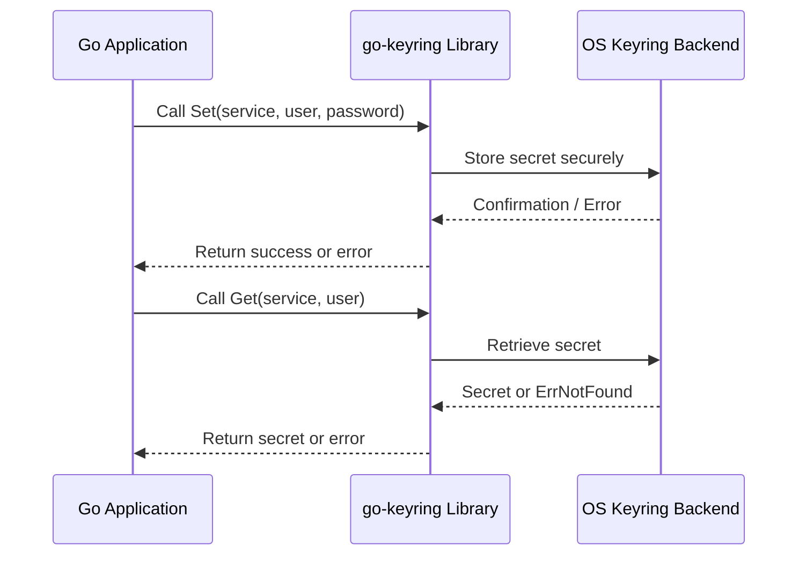

# Quickstart: Installing and Using go-keyring

Welcome to your first step with **go-keyring**! This guide takes you through installing the library, ensuring your system meets necessary prerequisites, and performing your first secret storage and retrieval using go-keyring's simple, unified API. Get ready to securely manage secrets natively on your operating system with minimal effort.

---

## 1. What You Will Achieve

- **Install** go-keyring into your Go project.
- **Validate** that necessary OS-level dependencies exist and are functional.
- **Set and get** a secret (password) in your system's keyring.
- Understand basic **error handling** and **common pitfalls**.

---

## 2. Prerequisites & Environment Setup

Before starting, ensure:

- You are using one of the supported platforms: **macOS, Linux/BSD, or Windows**.
- The platform-specific keyring service is accessible:
  - **macOS:** The `/usr/bin/security` binary is available (comes by default).
  - **Linux/BSD:** The Secret Service D-Bus interface is active (commonly via GNOME Keyring). Confirm the `login` keyring exists; if not, create it using Seahorse.
  - **Windows:** Windows Credential Manager is available.
- You have Go installed and configured in your development environment.

<Tip>
If you are unsure about platform readiness, consult the [Prerequisites & Supported Platforms](https://your-doc-link/getting-started/setup-basics/prerequisites) guide to verify OS and dependency setup.
</Tip>

---

## 3. Installing go-keyring

Add go-keyring to your Go project using the standard Go tooling. From your project root, run:

```bash
go get github.com/zalando/go-keyring
```

This command fetches the latest stable version of the library.

Verify installation by running:

```bash
go list -m github.com/zalando/go-keyring
```

You should see the module listed without errors.

<Tip>
Ensure your `go.mod` file is properly updated with the new dependency.
</Tip>

---

## 4. Your First Set and Get Operations

Let's walk through a real example to store and retrieve a secret.

### Step-by-Step Code Example

```go
package main

import (
    "log"
    "github.com/zalando/go-keyring"
)

func main() {
    service := "my-app"
    user := "anon"
    password := "secret"

    // Store password in the keyring
    err := keyring.Set(service, user, password)
    if err != nil {
        log.Fatal("Failed to set secret: ", err)
    }

    // Retrieve password from the keyring
    secret, err := keyring.Get(service, user)
    if err != nil {
        log.Fatal("Failed to get secret: ", err)
    }

    log.Printf("Retrieved secret: %s", secret)
}
```

### What Happens Next?

- The **Set** call saves your password securely in the platform's native keyring under the specified service and user.
- The **Get** call fetches that secret back, demonstrating a successful roundtrip.

<Tip>
This example uses a simple, single-line password. Multi-line or complex passwords are encoded automatically to avoid storage issues.
</Tip>

---

## 5. Understanding Platform Details and Constraints

| Platform  | Backend Dependency                               | Notes & Limits                     |
|-----------|------------------------------------------------|----------------------------------|
| macOS     | `/usr/bin/security` command line tool           | Passwords encoded with base64 to handle special chars and multiline
| Linux/BSD | Secret Service via DBus (GNOME Keyring default) | Requires `login` keyring collection
| Windows   | Windows Credential Manager                       | Password max 2560 bytes, service max ~30 KB

<Tip>
Each platform enforces size and encoding constraints. If you receive a `data too big` error, try shortening your secret.
</Tip>

---

## 6. Handling Errors Gracefully

- **ErrNotFound:** Returned if the secret does not exist for the given service and user.
- **ErrSetDataTooBig:** Data size exceeds platform or backend limits.
- **ErrUnsupportedPlatform:** Your current OS does not have a supported keyring implementation.

### Example Error Handling Snippet

```go
password, err := keyring.Get("my-app", "anon")
if err != nil {
    if err == keyring.ErrNotFound {
        log.Println("Secret not found, please set it first.")
    } else {
        log.Fatal(err)
    }
}
```

---

## 7. Verification

To verify your secret was stored and retrieved successfully:

1. Run your Go program.
2. Confirm the retrieved secret printed in your logs matches the password you set.
3. On **macOS**, you can open 'Keychain Access' to see stored items.
4. On **Linux**, use `seahorse` or `secret-tool` CLI to query keyrings.
5. On **Windows**, check via Credential Manager.

<Note>
If retrieval fails with permission or missing secret errors, ensure your user session has access to the keyring and the backend is running.
</Note>

---

## 8. Tips & Best Practices

- Always namespace secrets by **service** and **user** so they do not collide.
- Avoid storing sensitive data longer than needed.
- Use the `Delete` and `DeleteAll` APIs (see related guides) to clean up secrets securely.
- For unit tests or CI environments without access to real keyrings, use the **mock provider** feature for in-memory testing.

---

## 9. Common Pitfalls

- Forgetting to install or enable the OS keyring backend (especially Linux).
- Exceeding platform size limits, causing `ErrSetDataTooBig`.
- Not having the `login` keyring on GNOME Keyring setups.
- Running code on unsupported platforms.

Check the [Troubleshooting & Common Setup Issues](https://your-doc-link/getting-started/usage-validation/troubleshooting) guide for detailed diagnostics.

---

## 10. Next Steps & Further Reading

- Explore the [Deleting Secrets from the Keyring](https://your-doc-link/guides-tab/core-workflows/secrets-delete) guide to manage secret lifecycle.
- Learn about [Testing and Mocking go-keyring Operations](https://your-doc-link/guides-tab/scenarios-integration/testing-mocking) for seamless CI integration.
- Delve into platform-specific details with the [Platform Integration & Dependencies](https://your-doc-link/overview/architecture-usecases-integration/platform-integration) page.


---

## Summary Diagram: Keyring Operation Flow



This visualizes the interaction flow from your Go app through go-keyring to the platform's native keyring service.


---

# References

- [GitHub Repository - go-keyring](https://github.com/zalando/go-keyring)
- [Installation Guide](https://your-doc-link/getting-started/setup-basics/installation)
- [Prerequisites & Supported Platforms](https://your-doc-link/getting-started/setup-basics/prerequisites)
- [Troubleshooting & Common Setup Issues](https://your-doc-link/getting-started/usage-validation/troubleshooting)
- [Deleting Secrets from the Keyring](https://your-doc-link/guides-tab/core-workflows/secrets-delete)
- [Testing and Mocking go-keyring Operations](https://your-doc-link/guides-tab/scenarios-integration/testing-mocking)

---

Welcome to a safer, more convenient way to manage secrets in your Go applications!


