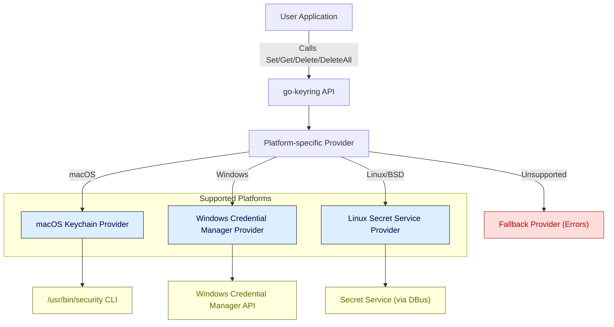

# Architecture Overview

Unlock the inner workings of go-keyring with this architectural deep dive. This page guides you through the components, flows, and platform integrations that enable go-keyring to seamlessly manage secrets across different operating systems. You'll see how the library interfaces with native backends, executes secret operations, and supports pluggable provider logic — all designed to provide a consistent and secure experience.

---

## How go-keyring Works: A Visual and Descriptive Overview

At the heart of go-keyring lies a simple goal: to enable your Go applications to **store**, **retrieve**, and **delete** secrets securely using the underlying OS keyring service, **regardless of platform**.

### Unified Interface with Platform-Specific Backends

The library exposes a clean interface for secret management, which delegates calls to platform-specific providers:

- **macOS:** Utilizes the native **macOS Keychain** through the `/usr/bin/security` command-line interface.
- **Windows:** Uses the Windows **Credential Manager** via the `wincred` package.
- **Linux/BSD:** Connects to the **Secret Service API** over DBus, commonly provided by GNOME Keyring.

If the platform is unsupported, a fallback provider returns explicit errors.

### Flow of Secret Management Operations

Each secret operation (*Set*, *Get*, *Delete*, *DeleteAll*) follows a clear pattern:

1. Your application calls one of the keyring functions (e.g., `Set(service, user, password)`).
2. The library directs this call to the initialized OS-specific provider.
3. The provider interacts with the native keyring backend using OS-specific mechanisms, handling any data encoding or size limitations.
4. The provider returns success or a well-defined error (`ErrNotFound`, `ErrSetDataTooBig`, etc.) back to the caller.

This flow ensures your app never needs to worry about platform differences, encoding nuances, or low-level details.

### Pluggable Provider Logic

The abstraction `Keyring` interface defines the contract each platform provider must implement:

- `Set(service, user, password string) error`
- `Get(service, user string) (string, error)`
- `Delete(service, user string) error`
- `DeleteAll(service string) error`

This design enables flexibility, allowing for easy mocking during tests or extending support for new platforms by adding custom providers.

---

## Component Interaction Diagram

Below is a Mermaid.js flowchart illustrating how go-keyring components interact across supported platforms. This diagram highlights the user-facing functions, internal provider delegation, platform-specific backends, and fallback mechanisms.

---

## Key Points of the Architecture

- **Single Entry Point:** Your application interacts with go-keyring through public API functions (`Set`, `Get`, etc.) abstracted from OS specifics.

- **Dynamic Provider Binding:** The correct platform provider is selected and assigned at package initialization (`init()`), ensuring calls delegate to the native backend.

- **Well-Defined Errors:** Common errors such as `ErrNotFound` and `ErrSetDataTooBig` provide clear signals about operation results and constraints.

- **Encoding Handling:** Some providers (notably macOS) encode stored passwords (e.g., base64) to handle multi-line or binary data.

- **Size Limit Awareness:** Platform constraints on secret size are explicitly handled, returning errors when exceeded.

- **Fallback Logic:** For unrecognized platforms or during testing, a fallback provider ensures graceful error reporting or in-memory mocking.

---

## Practical Example: Secret Operation Flow on macOS

Imagine you want to store a password for service "my-app" and user "alice":

1. Your app calls `keyring.Set("my-app", "alice", "supersecret")`.
2. The macOS provider's `Set` method encodes the password in base64 to ensure compatibility.
3. It invokes `/usr/bin/security` with the appropriate CLI arguments to add the generic password.
4. If the password plus metadata exceeds 3000 bytes, the provider returns `ErrSetDataTooBig`.
5. On success, the secret is securely stored in the system keychain.

This encapsulation means your app never directly manages native CLI calls or data encoding.

---

## Best Practices and Tips

- **Handle Errors Explicitly:** Always check for `ErrNotFound` to handle missing secrets cleanly.
- **Respect Size Limits:** Keep stored secrets concise to avoid `ErrSetDataTooBig`, especially on macOS and Windows.
- **Leverage Mock Provider for Testing:** Use `MockInit()` to replace the provider with an in-memory mock for automated tests without platform dependencies.
- **Use `DeleteAll` Carefully:** On supported platforms, `DeleteAll(service)` removes all secrets under a service but requires non-empty service names to prevent accidental full deletions.

---

## Next Steps

Ready to dive deeper? Consider exploring the following pages to broaden your understanding and begin using go-keyring effectively:

- [What is go-keyring?](/overview/product-intro-core-concepts/what-is-go-keyring)
- [Core Features & Benefits](/overview/product-intro-core-concepts/features-and-benefits)
- [Platform Integration & Dependencies](/overview/architecture-usecases-integration/platform-integration)
- [Quickstart: Set and Get Your First Secret](/getting-started/usage-validation/quickstart-example)

---

This architecture overview arms you with a clear mental model of go-keyring’s design, helping you trust its consistency and reliability across platforms as you integrate it into your Go applications.
