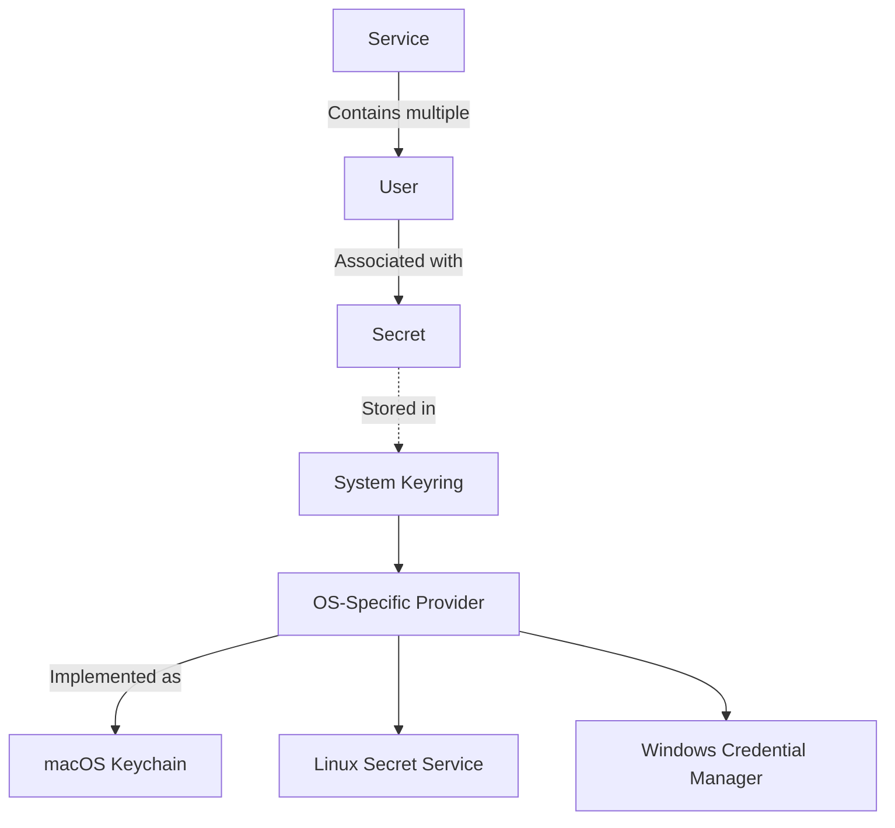

# Key Concepts & Terminology

Understanding the core terms used in go-keyring is fundamental to effectively using the library and communicating about its functionality. This page defines critical concepts such as **service**, **user**, **secret**, **provider**, and **keyring**, and explains how they relate to the API and real-world usage scenarios.

---

## Core Concepts

### Service
The `service` represents the name of the application or system component for which secrets are stored. It acts as a **namespace** or **category** under which secrets pertaining to that application are grouped.

**Why it matters:**
- Helps isolate secrets logically
- Allows multiple applications or modules to coexist within the same keyring

**Example:**
```go
service := "my-app"
```

### User
The `user` identifies the account or username associated with a secret within the service.

**Why it matters:**
- Enables storage of credentials for multiple users under the same service
- Distinguishes secrets when one application manages multiple user accounts

**Example:**
```go
user := "alice"
```

### Secret
A `secret` is the credential or sensitive data being stored in the keyring. This usually means passwords, tokens, API keys, or any confidential string.

**Why it matters:**
- It is the main object that go-keyring secures and manages
- Must be handled carefully due to its sensitive nature

**Example:**
```go
password := "S3cur3P@ssw0rd"
```

### Provider
The `provider` abstracts the underlying platform-specific keyring implementation. go-keyring supports different providers depending on the operating system, each interfacing with the native secure storage mechanism.

**Why it matters:**
- Enables cross-platform compatibility by encapsulating platform differences
- Users interact with a unified API, without worrying about implementation details

**Platform Providers:**
- macOS: Utilizes the `/usr/bin/security` tool for the macOS keychain
- Linux/BSD: Uses the Secret Service API via DBus and GNOME Keyring
- Windows: Integrates Windows Credential Manager

### Keyring
The `keyring` is the system-wide secure storage facility managed by the OS. It is the trusted vault where all secrets are stored by go-keyring providers.

**Why it matters:**
- Enforces OS-level security policies and encryption
- Enables safe storage, retrieval, and deletion of secrets


## How These Concepts Relate to go-keyring API
The public API methods use these terms clearly to facilitate user intent:

| API Method           | Parameters              | Purpose                          |
|---------------------|-------------------------|---------------------------------|
| `Set(service, user, secret)`    | `service`: string, `user`: string, `secret`: string | Stores or updates a secret        |
| `Get(service, user)`             | `service`: string, `user`: string                    | Retrieves a stored secret          |
| `Delete(service, user)`          | `service`: string, `user`: string                    | Deletes a secret                  |
| `DeleteAll(service)`             | `service`: string                                     | Deletes *all* secrets under a service |

### Practical Example

To save a user's password securely for your app:

```go
service := "my-app"
user := "alice"
password := "S3cur3P@ssw0rd"

err := keyring.Set(service, user, password)
if err != nil {
    log.Fatal(err)
}
```

Retrieve the password when needed:

```go
storedPassword, err := keyring.Get(service, user)
if err != nil {
    log.Fatal(err)
}
fmt.Println("Retrieved password:", storedPassword)
```

Delete the password when no longer needed:

```go
err = keyring.Delete(service, user)
if err != nil {
    log.Fatal(err)
}
```

---

## Best Practices & Tips

- Always specify both `service` and `user` when storing and retrieving secrets for precise access.
- Use descriptive service names to avoid collisions with other applications.
- Avoid storing overly large secrets; platform-specific limits exist (e.g., macOS ~3000 bytes total, Windows password max 2560 bytes).
- Leverage `DeleteAll(service)` cautiously to clean up all secrets under one service at once.
- For testing, use the `MockInit()` function to safely simulate keyring operations without affecting the real OS keyring.

---

## Troubleshooting Common Terminology Confusions

<AccordionGroup title="Common Questions and Clarifications">
<Accordion title="Is 'service' the same as 'application'?">
Not exactly, but they are closely related. The `service` serves as a unique identifier for your application or logical component within the keyring. 
It ensures separation of secrets between apps.
</Accordion>
<Accordion title="Can I use an email address as 'user'?">
Yes, the `user` string can be any identifier, including emails. It distinguishes each credential under the same service.
</Accordion>
<Accordion title="What happens if I use the same service and user with different secrets?">
Calling `Set` with the same `service` and `user` overwrites the existing secret in the keyring.
</Accordion>
</AccordionGroup>

---

## Visualizing the Relationship



---

## Summary
By mastering these key concepts — service, user, secret, provider, and keyring — you gain precise control over secret management with go-keyring. These terms lay the foundation for all interactions with the API, enabling clear, secure, and effective usage.

For hands-on guidance, review the [Quickstart: Set and Get Your First Secret](/getting-started/usage-validation/quickstart-example) page. Explore [Core Features & Benefits](/overview/product-intro-core-concepts/features-and-benefits) for practical API contexts.

---

## References and Next Steps
- [What is go-keyring?](/overview/product-intro-core-concepts/what-is-go-keyring): Understand the product overview and value proposition.
- [Core Features & Benefits](/overview/product-intro-core-concepts/features-and-benefits): Deep dive into what go-keyring offers.
- [Quickstart: Set and Get Your First Secret](/getting-started/usage-validation/quickstart-example): Learn to use go-keyring with simple examples.

<Tip>
Use clear, distinct service and user identifiers in your applications to avoid accidental overwrites or deletions when managing secrets.
</Tip>

<Note>
If you encounter platform support issues, verify your OS keyring availability and see [Platform Integration & Dependencies](/overview/architecture-usecases-integration/platform-integration) for system requirements.
</Note>

<Check>
Remember: The provider is the bridge between go-keyring's API and the OS keyring — the true secure vault.
</Check>
